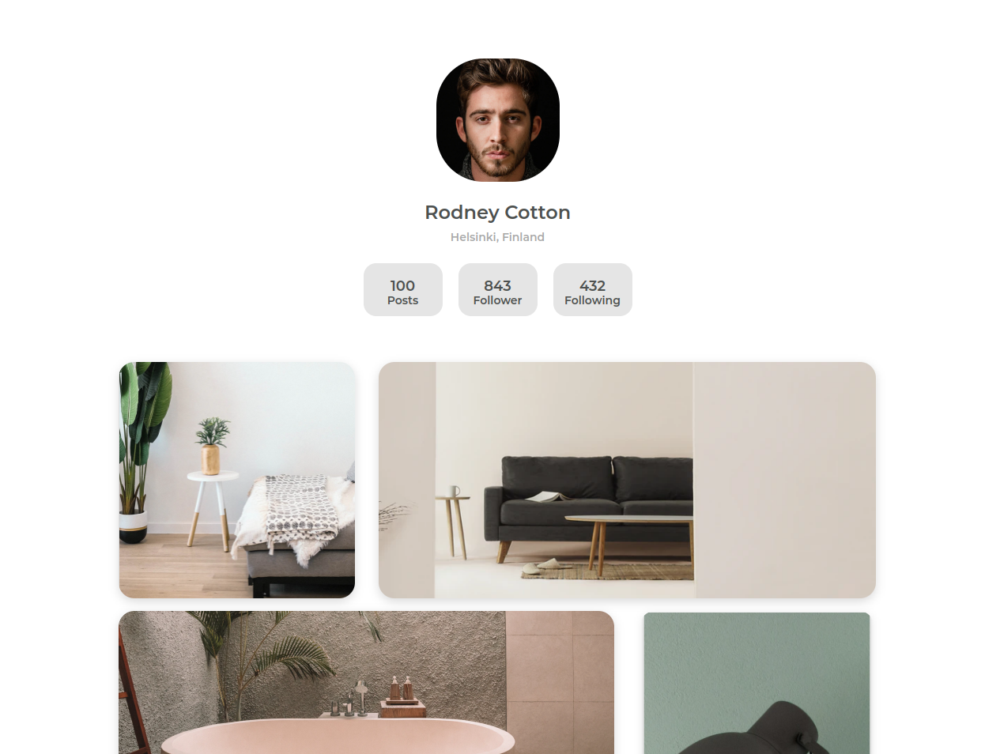

<h1 align="center">My Gallery</h1>

   Solution for a challenge from  <a href="http://devchallenges.io" target="_blank">Devchallenges.io</a>.

  <h3>
    <a href="https://kelex21.github.io/my_gallery/">
      Demo
    </a>
     | 
    <a href="https://devchallenges.io/solutions/zbNmB4LJuzSgDH0RVDYv">
      Solution
    </a>
     | 
    <a href="https://devchallenges.io/challenges/gcbWLxG6wdennelX7b8I">
      Challenge
    </a>
  </h3>

## Table of Contents

- [Overview](#overview)
- [Built With](#built-with)
- [Features](#features)
- [Contact](#contact)

## Overview

### Built With

- HTML
- CSS
  * FLEXBOX
  * GRID
- SCSS

## Features

This application/site was created as a submission to a [DevChallenges](https://devchallenges.io/challenges) challenge. The [challenge](https://devchallenges.io/challenges/hhmesazsqgKXrTkYkt0U) was to build an application to complete the given user stories.

## Contact

- GitHub [@Kelex21](https://github.com/Kelex21)
- Twitter [@KelexG21](https://twitter.com/KelexG21)